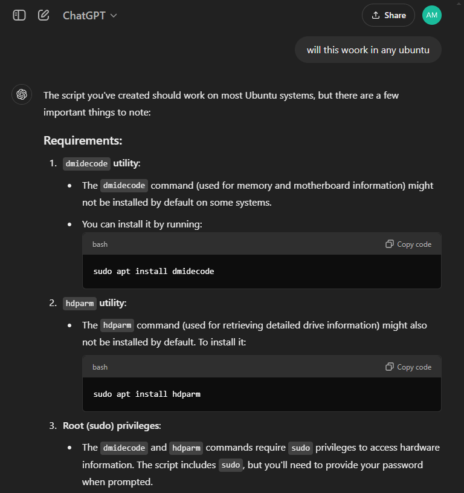
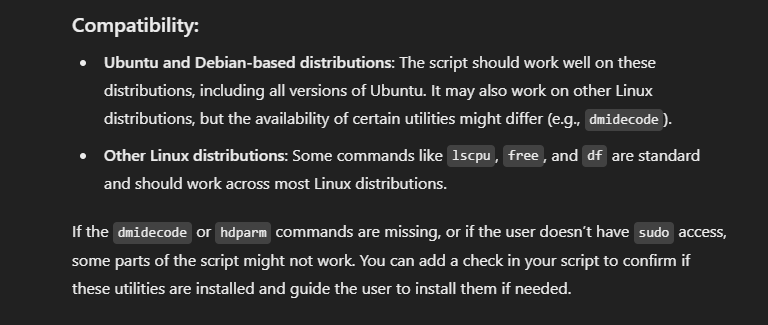

# Steps to Run the System Info Script

bash
# 1. Open the terminal

# 2. Navigate to the folder where the script (system_info.sh) is located
# For example, if it's in the Documents folder, use this command:
cd ~/Documents

# 3. Run the script using the following command:
./system_info.sh

# If you encounter a "Permission denied" error, you need to make the script executable. Run this command:
chmod +x system_info.sh

# 4. Once the script runs, it will generate a file named system_info.txt in the same folder, containing detailed system information.

# 5. To view the contents of the system_info.txt file, you can use:
cat system_info.txt

# Or open it with a text editor like nano or gedit:
nano system_info.txt

# This will show all the steps within a single block of code.

